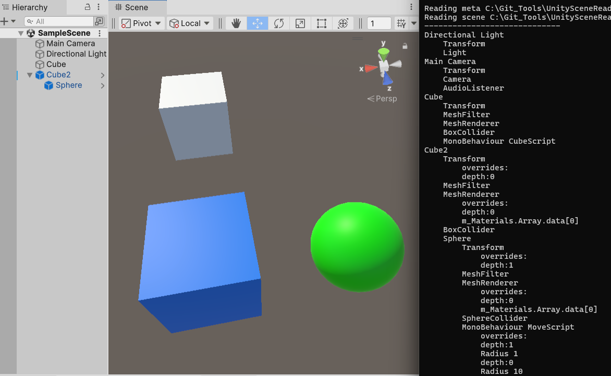

## Unity Scene Reader

### What it does
Unity Scene Reader reads unity scene files, meta files, prefab files, resolves guids, file ids, anchors, script files, prefab overrides etc. etc. 
and puts them all into a convenient object tree.

### Why?
Unity scene files are quite complex, especially after the introduction of the nested prefabs feature with guids and file references all over the place,
and sometimes you wish to implement some additional pre-commit checks or to read the scene on your authoritative server for player validation.
Unity Scene Reader will help you with this.

### What it doesn't
Sadly, Unity Scene Reader is not a writer. It also doesn't actually create objects and doesn't create/modify components.